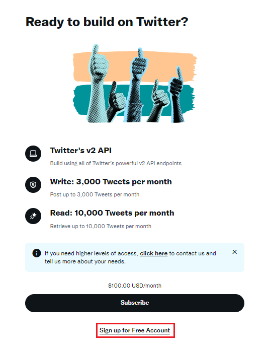
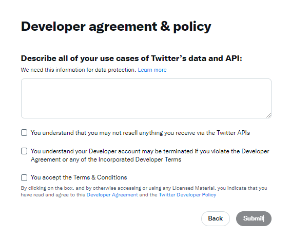

# YouTube-Uploads-Notifyer

YouTubeの新着アップロードをX(=Twitter)とDiscordで自動通知します。  
Automatically notifying new YouTube uploads on X(=Twitter) and Discord.

- [X のフリープランへ登録する方法](#x-のフリープランへ登録する方法)
- [X へのpostするためのキーを取得する](#x-へのpostするためのキーを取得する)
- [Discord へpostするためのwebhookurlを取得する](#discord-へpostするためのwebhookurlを取得する)
- [GitHubに登録する](#githubに登録する)
- [GitHubにこのアクションを使うためのリポジトリを作成する](#githubにこのアクションを使うためのリポジトリを作成する)
- [作ったリポジトリに各種設定値を隠蔽して登録する](#作ったリポジトリに各種設定値を隠蔽して登録する)
- [作ったリポジトリにアクションを設定する](#作ったリポジトリにアクションを設定する)

***

## Parameters
- `youtube_channel_id`
  - YouTubeのチャンネルIDです。カスタマイズページの「チャンネル URL」の欄に「UC」から始まる文字列があります。
  - Ex. `UCx8MhUwaY1_7C45USYgzVeg`
- `youtube_playlist_id` 
  - YouTubeのプレイリストIDです。プレイリストのURLに「PL」から始まる文字列があります。
  - Ex. `PLGF8z568UBSJLFXYGS4FabcKT_66Wv_ug`
- `hash_tag`
  - 通知を行う時のハッシュタグです
- `x_consumer_key`
  - Xのコンシューマキーです。Freeのプランで良いので、Xの開発者登録を行う必要があります。Xに通知する時は入力してください。
- `x_consumer_secret`
  - Xのコンシューマシークレットです。Freeのプランで良いので、Xの開発者登録を行う必要があります。Xに通知する時は入力してください。
- `x_access_key`
  - Xのアクセスキーです。Freeのプランで良いので、Xの開発者登録を行う必要があります。Xに通知する時は入力してください。
- `x_access_secret`
  - Xのアクセスシークレットです。Freeのプランで良いので、Xの開発者登録を行う必要があります。Xに通知する時は入力してください。
- `discord_webhook_url`
  - Discordのウェブフックです。Discordに通知する時は入力してください。

## Example

このアクションはリポジトリにいくつかのファイルを保存します。
コミットをするように設定が必要です。

```yml
name: Sample
on:
  schedule:
    - cron: "0 * * * *" #毎時0分
  # 「アクション」タブからこのワークフローを手動で実行できます。
  workflow_dispatch:

jobs:
  samplejob:
    runs-on: ubuntu-latest
    steps:
      - name: checkout repo content
        uses: actions/checkout@v3 # checkout the repository content to github runner.
      - name: execute YouTube-Uploads-Notifyer
        uses: Twilight-Wings-Studio/YouTube-Uploads-Notifyer/@main
        with:
          youtube_channel_id: ${{vars.YOUTUBE_CHANNEL_ID}}
          youtube_playlist_id: ${{vars.YOUTUBE_PLAYLIST_ID}}
          hash_tag: ''
          x_consumer_key: ${{secrets.X_CONSUMER_KEY}}
          x_consumer_secret: ${{secrets.X_CONSUMER_SECRET}}
          x_access_key: ${{secrets.X_ACCESS_KEY}}
          x_access_secret: ${{secrets.X_ACCESS_SECRET}}
          discord_webhook_url: ${{secrets.DISCORD_WEBHOOK_URL}}
      - name: execute commit
        run: |
          git config user.name github-actions
          git config user.email github-actions@github.com
          git add .
          git commit -m "crongenerated"
          git push
        continue-on-error: true
      - if: ${{ steps.git-pr-release.outputs.error != '' && !contains(steps.git-pr-release.outputs.error, 'No pull requests to be released') }}
        run: |
          echo '::error ::git-pr-release failed with "${{ steps.git-pr-release.outputs.error }}"'
          exit 1
```
***

## X のフリープランへ登録する方法

1. 下記へアクセス  
   https://developer.twitter.com/en/portal/petition/essential/terms?plan=free
1. 「Sign up for Free Account」をクリック  
   
1. 下記のページに着ます  
   
1. TwitterのデータとAPIの使用例を250文字以上で説明します。
1. すべてチェックを入れる
1. 「Submit」をクリックする

X APIを使用する時の説明例（そのまま使っても恐らく通ります）
```
Xに自身のYouTubeのストリームや動画投稿の通知を自動POSTするbotの作成を行います。
今は開発段階ですが、ゆくゆくはサービスとして運用する予定です。
We will create a bot that automatically posts notifications of your own YouTube streams and video posts to X.
It is currently in the development stage, but we plan to eventually operate it as a service.
```

## X へのPOSTするためのキーを取得する

## Discord へPOSTするためのWebhookURLを取得する

## GitHubに登録する

## GitHubにこのアクションを使うためのリポジトリを作成する

## 作ったリポジトリに各種設定値を隠蔽して登録する

## 作ったリポジトリにアクションを設定する

# Twilight Wings Studio Streamer Apps

[なりきりVTuber](https://store.steampowered.com/app/1632350?utm_source=GitHub&utm_content=YouTube-Uploads-Notifyer)  
[自動切るクリップ](https://store.steampowered.com/app/1632800?utm_source=GitHub&utm_content=YouTube-Uploads-Notifyer)
